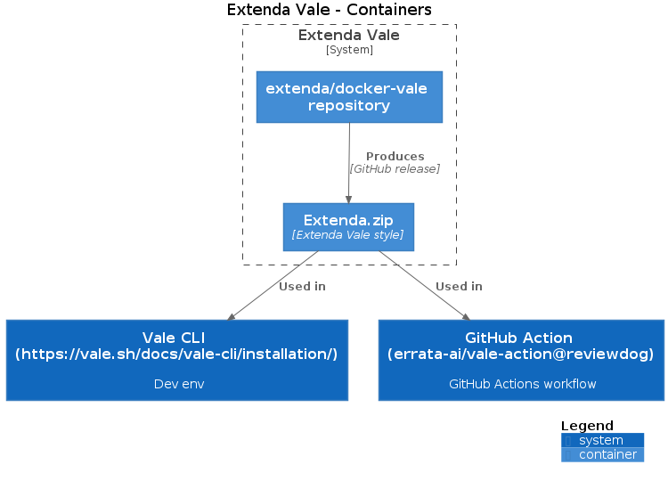

# docker-vale

This repository produce two artifacts:
* docker image `extenda/vale`
* Extenda style and vocabulary [zip](https://github.com/extenda/docker-vale/releases/tag/latest)

The docker image aims to make it easier to lint natural language through CLI, pre-commit hooks, and GitHub Actions.

It contains the following:

* [Vale CLI](https://github.com/errata-ai/vale)
* Extenda Vale lint [style](.github/styles/Extenda)
* Extenda Vale lint [vocabulary](.github/styles/Vocab/Extenda).
* A default Vale [configuration file](vale.ini). Command-line arguments can override some default settings, see `--help` for more information.

This docker image is known to be used by the following repositories:
* [pre-commit hooks](https://github.com/extenda/pre-commit-hooks)
* [action](https://github.com/extenda/actions/tree/master/vale-linting)
*
  * :warning: only use the Extenda style (`.github/styles/Extenda` + `.github/styles/Vocab/Extenda`) which is released as a zip file



## Usage


### Examples

To start using Vale, run with argument `--help`
```bash
docker run --rm -v $(pwd):/project_root -w /project_root extenda/vale --help
```

To lint everything, run with argument `.`
```bash
docker run --rm -v $(pwd):/project_root -w /project_root extenda/vale .
```

See the [Vale repository docs](https://docs.errata.ai/) for more information.

#### Running docker-vale as Pre-commit hook

Vale lint is a part of [Extenda pre-commit hooks](https://github.com/extenda/pre-commit-hooks), and you configure it in the following way.

```yaml
- repo: git://github.com/extenda/pre-commit-hooks
    rev: v0.7 # Use the ref you want to point at
    hooks:
      - id: vale
```

#### Running docker-vale as an NPM action

package.json

```json
"scripts": {
    "vale-lint": "docker pull extenda/vale && docker run --rm -v $(pwd):/p -w /p extenda/vale --no-wrap --minAlertLevel=error $(git diff --name-only)"
  }
```

### Ignoring linter feedback in your markdown

You may ignore lines, words, or sections in your markdown to be able to write words that are giving false-positive errors in a markdown file by following these examples.

```md
<!-- vale Extenda.ExtendaTerm = NO -->
This sentence needs the word that is otherwise an error in the Extnda.ExtendaTerm style.
<!-- vale Extenda.ExtendaTerm = YES -->
```

```md
This is a sentence has a word that will be ignored in the `Extenda.ExtendaTerm` style <!-- vale Extenda.ExtendaTerm = NO -->'ignored-word'.<!-- vale Extenda.ExtendaTerm = YES -->
```

### Configuration

The tool is configured with the [vale.ini](vale.ini) file. It describes the default parameters used. Additional configuration can be found [here](https://docs.errata.ai/).

## Development

### Getting started

Set up pre-commit hooks:
```bash
pre-commit install
```

Installing dependencies for testing
```bash
npm install
```

### Build and run the docker image locally

```bash
docker build -t local-vale .
docker run --rm -v $(pwd):/project_root -w /project_root local-vale "$@"
```

### Prerequisites

* [Docker](https://docs.docker.com/get-docker/)
* [Node](https://nodejs.org/)
* [pre-commit hooks](https://pre-commit.com/)

### Testing

The test harness is made up of the following:
* Style yaml file. Located under `.github/styles/Extenda`.
* Fixture test folder. For example `fixtures/Terms`. This folder contains:
  * `.vale.ini` - fixture test configuration.
  * `test.md` - markdown file that will be linted for errors, warning, and/or suggestions.
* Rules file that will assert the lint of the `test.md` file above. Located under `features/rules.feature`

#### Running the tests

```bash
npm run test
```

#### Adding new linting rules with corresponding test

Tests are based on naming conventions. A folder under the `fixtures` folder MUST match the corresponding style file under `.github/styles/`.
For example the test fixture folder `fixtures/BusinessUnits` MUST be named the same as `.github/styles/Extenda/BusinessUnits.yml`.

Here is a scenario where we want to add a new style file name `New.yml`

1. Create style file `.github/styles/Extenda/New.yml`
2. Create fixture folder `fixtures/New`
3. Create vale.ini config for just this style file `fixtures/New/.vale.ini`
4. Create test.md file that will some lines that will pass and some that will fail `fixtures/New/test.md`
5. Add a section for `New` in `features/rules.feature`.

#### C4 diagrams

All C4 diagrams must be created with [Structurizr DSL](https://github.com/structurizr/dsl#readme). Use the provided
`dsl2png.sh` script to create PNG images from the DSL. Use the `--watch` flag while making changes.
This will give a live preview of the diagrams in your browser at http://localhost:3000.

```bash
./dsl2png.sh --watch
```
> :bulb: On Windows 10? Use `dsl2png.cmd` instead.

## Maintainers

The docker-vale maintainers are the members of the following team:

- [Development chapter](https://github.com/orgs/extenda/teams/chapter-development)

## Contributions

This section contains some guidance how to contribute changes to areas that require tooling.
In general, the toolchain depends on [Docker](https://docker.io).
It also uses

## License
Distributed under the MIT License. See [LICENSE](LICENSE) for more information.
